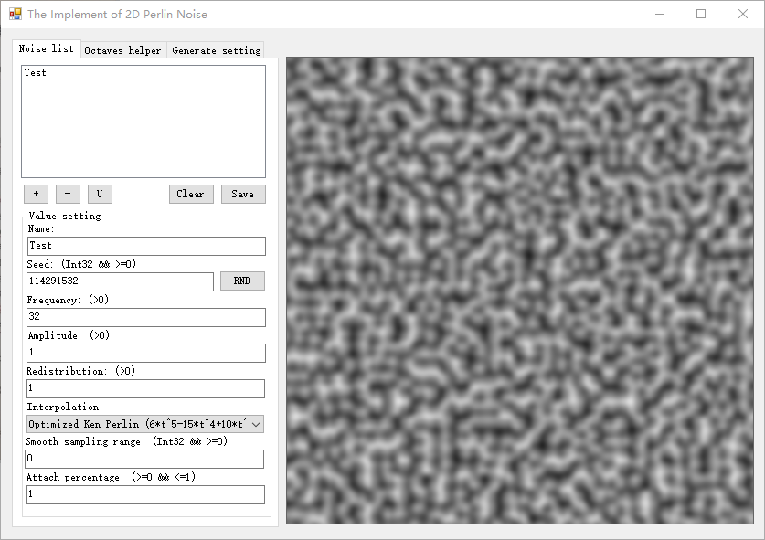
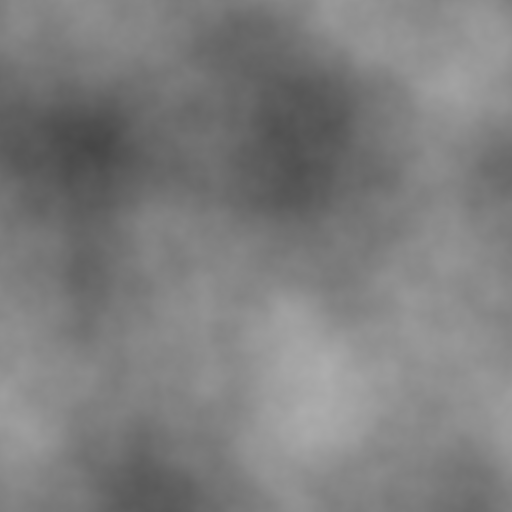

# The Implement of 2D Perlin Noise

## Warning

**Don't use this repository's core algorithm. I'm very not sure that my algorithm is correct perlin noise algorithm. I don't burden any consequence if you use this repository or get a wrong answer.**

This repository is just for fun. I create this repository after reading some perlin noise's articles. And almost algorithm is created by myself. I almost don't use any existed algorithms. This is the reason why I suggest that you don't use this repository's algorithm. I'm not sure that my algorithm is correct.

## Brief introduction

### Basic

This app support hybrid perlin noises. You can assign 2 or more noise configs and app will mix them automatically. At the same time, the compute time will be increased.

For each independ noise function. We support these config:

* Seed
* Frequency
* Amplitude
* Redistribution
* Interpolation
* Smooth **(Unsupported currently)**
* Attach percentage

App will output a 512x512 bitmap which contains 2D perlin noise. This size couldn't be changed.

App support colorful output and gray output. You can set this config in Generate setting page.

### Octaves

We don't support explicit octaves. Because we support alterntive, noise hybrid list. But, you still can use octaves via openning the tab called **Octaves helper**. In that page, app will display 2 settings and you can edit them. Then, click the button. A series of octaves' noise functions will be added into noise list automatically.

In obvious words, Noise list replaces octaves and noise list provides more mix settings. We use a tab to help you to create octaves function quickly.

## Screenshots

### Main window



### Octaves result

Result:



Hybird settings (Generated from octaves helper page):

```json
{
    "NoiseList": [
        {
            "Name": "Octave_Layer_1",
            "Seed": 1697907703,
            "Frequency": 2.0,
            "Amplitude": 0.5,
            "Redistribution": 1.0,
            "Interpolation": 5,
            "Smooth": 0,
            "AttachPercentage": 1.0
        },
        {
            "Name": "Octave_Layer_2",
            "Seed": 2134901678,
            "Frequency": 4.0,
            "Amplitude": 0.25,
            "Redistribution": 1.0,
            "Interpolation": 5,
            "Smooth": 0,
            "AttachPercentage": 1.0
        },
        {
            "Name": "Octave_Layer_3",
            "Seed": 853413485,
            "Frequency": 8.0,
            "Amplitude": 0.125,
            "Redistribution": 1.0,
            "Interpolation": 5,
            "Smooth": 0,
            "AttachPercentage": 1.0
        },
        {
            "Name": "Octave_Layer_4",
            "Seed": 347153476,
            "Frequency": 16.0,
            "Amplitude": 0.0625,
            "Redistribution": 1.0,
            "Interpolation": 5,
            "Smooth": 0,
            "AttachPercentage": 1.0
        },
        {
            "Name": "Octave_Layer_5",
            "Seed": 440027379,
            "Frequency": 32.0,
            "Amplitude": 0.03125,
            "Redistribution": 1.0,
            "Interpolation": 5,
            "Smooth": 0,
            "AttachPercentage": 1.0
        },
        {
            "Name": "Octave_Layer_6",
            "Seed": 1113771375,
            "Frequency": 64.0,
            "Amplitude": 0.015625,
            "Redistribution": 1.0,
            "Interpolation": 5,
            "Smooth": 0,
            "AttachPercentage": 1.0
        }
    ]
}
```
